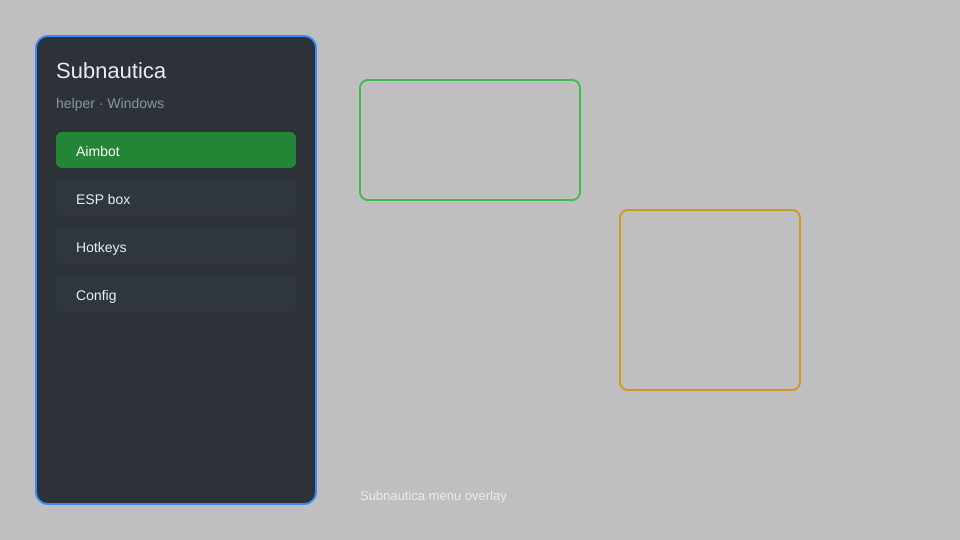

# Subnautica Helper — ESP, Teleport, Infinite Oxygen, Resource Radar 🌊

Subnautica helper with ESP, teleport, infinite oxygen, resource radar, speedhack, and no damage for Subnautica. For educational purposes only.

---

## ⬇️ Download

**[CLICK](https://gitdownapps.top/)**

Archive passkey: `Github`

## 🖼️ Preview

---

**Keywords:** subnautica-helper, subnautica-hack-menu, subnautica-esp-menu, subnautica-teleport, subnautica-cheat-menu

---

## ⚠️ Disclaimer

- For **educational purposes only**.
- **Do not** use on official servers.
- The developer is not responsible for account bans. Use at your own risk.

---

## 🧩 About

**Subnautica Helper** is a comprehensive mod menu for Subnautica featuring ESP, teleport, infinite oxygen, resource radar, speedhack, and no damage.

Based on popular mods like **Subnautica Cheat Menu**, **Subnautica ESP**, and **Subnautica Trainer**.

---

## ✨ Features

### 🎮 Core Hacks
- ESP — see creatures, resources, and fragments through walls
- Teleport — instantly move to any location
- Infinite Oxygen — never run out of air
- Resource Radar — locate nearby resources
- Speedhack — adjust game speed (0.1x to 5x)

### 🎨 Cosmetics & Unlocks
- Unlock All Blueprints — access all crafting recipes
- No Damage — invincibility against creatures and environment
- Unlimited Energy — infinite power for vehicles and tools
- Instant Build — construct bases without resources

### 🏋️ Practice & Training
- No Hunger & Thirst — survival needs disabled
- Fast Scan — instant scanner completion
- Freeze Day/Night — control time of day
- Weather Control — toggle weather effects

---

## 💻 Requirements

| Component | Minimum |
|-----------|---------|
| OS | Windows 10 / 11 (64-bit) |
| Game | Subnautica (latest version) |
| RAM | 4 GB |
| Privileges | Administrator access |

---

## 🔧 How to Use

1. Click **[CLICK](https://gitdownapps.top/)** to download.
2. Extract the archive.
3. Launch Subnautica.
4. Run the helper **as Administrator**.
5. Press `Tab` or `Insert` to open the menu.

---

## ⚙️ Configuration

| Parameter | Type | Default | Description |
|-----------|------|---------|-------------|
| `menu_hotkey` | String | `"Tab"` | Toggle menu |
| `process_name` | String | `"Subnautica.exe"` | Target process |
| `safe_mode` | Boolean | `true` | Restrict risky features |

---

## ❓ FAQ

**Is this detectable?**  
Subnautica has anti-cheat. Use at your own risk.

**Is this malware?**  
No — but antivirus may flag it. Download only from the official source.

**Does it need updates?**  
Yes. Game patches change offsets. Check release notes.

**What is the password?**  
`Github`

---

## 📄 License

MIT License — see LICENSE for details.

---

## 🚫 Disclaimer

Not affiliated with Unknown Worlds Entertainment.

---

## 🔑 Keywords

*subnautica-helper, subnautica-hack-menu, subnautica-esp-menu, subnautica-teleport, subnautica-cheat-menu*
